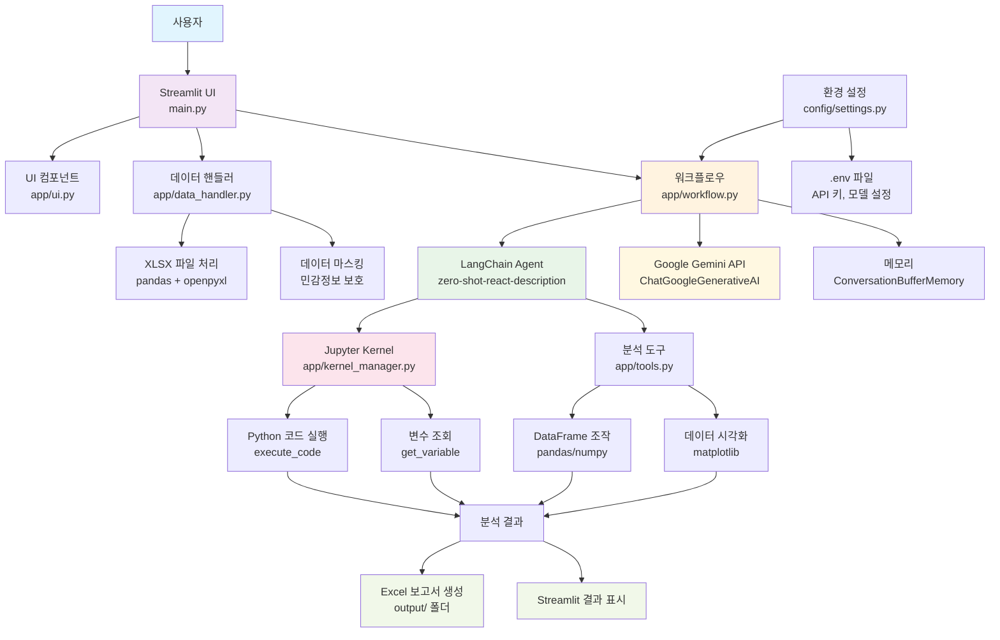

# Claude.md - AI Agent for SCM 프로젝트

## 프로젝트 개요
이 프로젝트는 **AI Agent를 활용한 생산 데이터 관리** 시스템입니다. 사용자가 엑셀(xlsx) 파일을 업로드하면 AI가 데이터를 분석하고 Excel 형태의 보고서를 생성해주는 서비스입니다.

## 기술 스택
- **Frontend**: Streamlit (웹 UI)
- **Backend**: Python 3.11+
- **AI/ML**: LangChain, Google Generative AI (Gemini)
- **Data Processing**: Pandas, NumPy, OpenPyXL
- **Code Execution**: Jupyter Kernel
- **Environment**: venv, python-dotenv

## 프로젝트 구조
```
P1_hamster451/
├── app/
│   ├── __init__.py
│   ├── data_handler.py      # XLSX 전처리 및 마스킹
│   ├── kernel_manger.py     # Jupyter 커널 관리
│   ├── tools.py             # DataFrame 분석/조작 함수
│   ├── ui.py                # Streamlit UI 로직
│   └── workflow.py          # LLM + Agent + 도구 오케스트레이션
├── config/
│   ├── __init__.py
│   └── settings.py          # 환경 변수 설정
├── docs/
│   └── meeting_note/        # 프로젝트 회의록
├── output/                  # 분석 결과 출력 폴더
├── study/                   # 연구/개발 관련 파일
├── utils/
│   ├── __init__.py
│   └── pdf_utils.py         # PDF 변환 유틸리티
├── main.py                  # Streamlit 애플리케이션 진입점
├── requirements.txt         # Python 의존성
└── README.md
```

## 시스템 아키텍처

### 아키텍처 다이어그램


### 계층별 아키텍처 설명

#### 1. **프레젠테이션 계층 (Presentation Layer)**
- **Streamlit UI (main.py)**: 웹 인터페이스 제공
- **UI 컴포넌트 (app/ui.py)**: 파일 업로드, 입력 폼 등

#### 2. **비즈니스 로직 계층 (Business Logic Layer)**
- **워크플로우 (app/workflow.py)**: 전체 분석 프로세스 오케스트레이션
- **데이터 핸들러 (app/data_handler.py)**: XLSX 파일 처리 및 전처리
- **분석 도구 (app/tools.py)**: 데이터 분석 함수 모음

#### 3. **AI/ML 계층 (AI/ML Layer)**
- **LangChain Agent**: 자연어 처리 및 작업 계획
- **Google Gemini API**: 대화형 AI 모델
- **메모리**: 대화 히스토리 관리

#### 4. **실행 계층 (Execution Layer)**
- **Jupyter Kernel**: 안전한 Python 코드 실행 환경
- **코드 실행기**: 동적 데이터 분석 코드 실행
- **변수 관리**: 실행 결과 및 상태 관리

#### 5. **데이터 처리 계층 (Data Processing Layer)**
- **Pandas/NumPy**: 데이터프레임 조작 및 계산
- **OpenPyXL**: Excel 파일 읽기/쓰기
- **Matplotlib**: 데이터 시각화

#### 6. **설정 계층 (Configuration Layer)**
- **환경 설정 (config/settings.py)**: 시스템 설정 관리
- **.env 파일**: API 키, 모델 설정 등 민감정보

### 데이터 플로우
1. **입력**: 사용자가 XLSX 파일 업로드 + 자연어 질의
2. **전처리**: 데이터 마스킹 및 DataFrame 변환
3. **AI 분석**: LangChain Agent가 질의 분석 및 실행 계획 수립
4. **코드 실행**: Jupyter Kernel에서 Python 분석 코드 실행
5. **결과 생성**: Excel 보고서 생성 및 UI 표시

## 핵심 기능

### 1. 데이터 업로드 및 처리
- 사용자가 XLSX 파일을 Streamlit UI를 통해 업로드
- `data_handler.py`에서 데이터프레임으로 변환 및 민감데이터 마스킹 처리

### 2. AI 기반 데이터 분석
- LangChain Agent가 사용자의 자연어 질의를 처리
- Google Gemini API를 통한 대화형 분석
- Jupyter Kernel을 통해 Python 코드 실행 및 데이터 분석

### 3. 보고서 생성
- 분석 결과를 Excel 형태로 내보내기
- 시각화 및 차트 생성 지원

## 주요 파일 설명

### main.py:1-34
- Streamlit 애플리케이션의 진입점
- UI 렌더링, 파일 업로드, 워크플로우 실행을 조정

### app/workflow.py:9-59
- LangChain Agent 기반 워크플로우 관리
- Google Generative AI 모델 초기화
- Jupyter Kernel과 연동하여 코드 실행 및 변수 조회 도구 제공

### config/settings.py:1-15
- 환경 변수 관리 (.env 파일 로드)
- Google API 키 및 모델 설정

## 환경 설정

### 필수 환경 변수 (.env 파일)
```
GOOGLE_API_KEY=your_google_api_key_here
MODEL=gemini-2.5-pro
```

### 개발 환경 설정
```bash
# 가상환경 생성 및 활성화
python -m venv .venv
source .venv/bin/activate  # macOS/Linux
.venv\Scripts\activate     # Windows

# 의존성 설치
pip install -r requirements.txt

# Jupyter 커널 등록
python -m ipykernel install --user --name=python3 --display-name "Python 3 (.venv)"
```

### 실행 방법
```bash
streamlit run main.py
```

## 개발 가이드라인

### 코딩 컨벤션
- PEP8 스타일 가이드 준수
- 함수 및 클래스에 대한 docstring 작성
- 변수명은 의미있고 명확하게 작성

### 커밋 메시지 규칙
- `feat:` 새로운 기능 추가
- `fix:` 버그 수정
- `refactor:` 코드 구조 개선
- `docs:` 문서 변경
- `chore:` 빌드, 패키지 등 기타 작업

### 보안 주의사항
- API 키 등 민감 정보는 .env 파일에 저장하고 .gitignore에 포함
- 사용자 데이터 마스킹 처리 필수
- LLM 호출 시 대용량 데이터 성능 고려

## 향후 개선 계획
- 데이터베이스 연결 기능 추가
- 자동 리포트 생성 스케줄링
- 웹 대시보드 시각화 기능
- 다양한 파일 형식 지원 (CSV, JSON 등)

## 트러블슈팅
- Jupyter Kernel 관련 이슈: 커널 재시작 또는 재등록
- API 키 오류: .env 파일 설정 확인
- 의존성 오류: requirements.txt 재설치

## 참고 사항
- Python 3.11 이상 권장
- Streamlit 기본 포트: http://localhost:8501
- 프로젝트 문서는 docs/ 폴더에서 관리